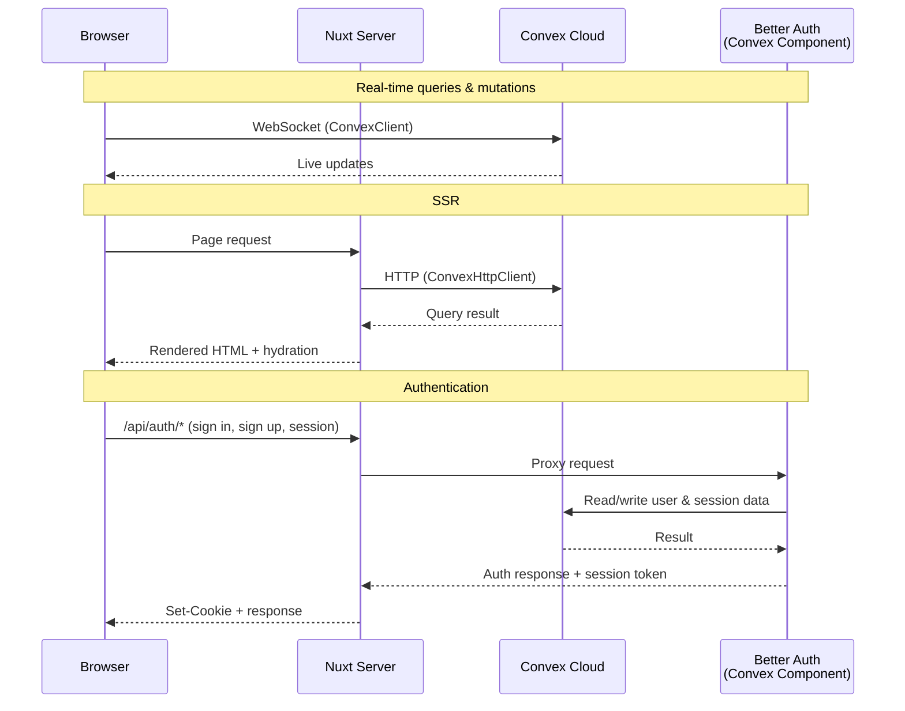

# nuxt-backend

[![npm version][npm-version-src]][npm-version-href]
[![npm downloads][npm-downloads-src]][npm-downloads-href]
[![License][license-src]][license-href]
[![Nuxt][nuxt-src]][nuxt-href]

Integrate [Convex](https://convex.dev) with [Nuxt](https://nuxt.com) — ships a **Nuxt module** and a **Convex component** in a single package.

The **Nuxt module** wires up real-time composables, SSR helpers, server utilities, and an auth proxy.
The **Convex component** provides a ready-made authentication backend powered by [Better Auth](https://www.better-auth.com).

## Features

### Nuxt Module
- 🔌 **Real-time Convex client** — `ConvexVueClient` in app code via `useConvex`, `useQuery`, `useMutation`, and `useAction`
- 🔄 **SSR** — Next-style server helpers (`fetchQuery`, `fetchMutation`, `fetchAction`, `preloadQuery`) plus client hydration with `usePreloadedQuery`
- 📦 **Auto-imports** — Composables and server utilities, zero manual imports
- 🛡️ **Route protection** — `auth` middleware to guard pages
- 🏗️ **Auto-scaffold** — Minimal Convex root files generated on first run

### Convex Component
- 🔐 **Authentication** — Email/password out of the box via Better Auth
- 🗄️ **Adapter layer** — Proxies Better Auth data operations through Convex
- 🌐 **HTTP router** — Auth endpoints served as Convex HTTP actions

## Installation

### 1. Install the package

```bash
npm install nuxt-backend
```

### 2. Add the module

```ts
// nuxt.config.ts
export default defineNuxtConfig({
  modules: ['nuxt-backend'],
})
```

### 3. Configure environment

Create a `.env` file in your project root:

```bash
CONVEX_URL=https://your-deployment.convex.cloud
CONVEX_SITE_URL=https://your-deployment.convex.site
```

In the [Convex dashboard](https://dashboard.convex.dev), set these environment variables:

```
SITE_URL=http://localhost:3000
BETTER_AUTH_SECRET=<random-secret>
```

### 4. Start development

```bash
npm run dev
```

On first run the module scaffolds the minimum Convex files that wire your app to the packaged component. If your app already has a configured Convex functions directory, scaffolding reuses it; otherwise it creates `backend/` by default:

```
your-project/
├── backend/
│   ├── convex.config.ts   # Mounts the packaged Convex component
│   ├── auth.config.ts     # Convex auth provider config for Better Auth
│   └── auth.ts            # Better Auth helpers bound to the component
├── convex.json            # Points the Convex CLI at backend/
└── .env
```

### 5. Start Convex

```bash
npx convex dev     # Development
npx convex deploy  # Production
```

---

## Client APIs

The Nuxt module auto-imports two API groups in app code:

- Convex Vue APIs from the package runtime (`useConvex`, `useQuery`, `useQueries`, `useMutation`, `useAction`, `usePaginatedQuery`, `usePreloadedQuery`, `useConvexConnectionState`)
- Better Auth helpers (`useAuth`, `useSession`, `useAuthClient`)

### `useConvex()` and `$convex`

```vue
<script setup lang="ts">
const convex = useConvex()
// or: const { $convex } = useNuxtApp()
</script>
```

Returns the client-side `ConvexVueClient` injected by the Nuxt plugin. There is no server-side `$convex` injection; in Nitro routes and other server code, use `fetchQuery`, `fetchMutation`, `fetchAction`, or `preloadQuery` instead.

### `useQuery()` / `useConvexQuery()`

The positional overload returns a `ShallowRef<T | undefined>` and throws query errors.

```vue
<script setup lang="ts">
import { computed } from 'vue'
import { api } from '~/backend/_generated/api'

const messages = useQuery(api.messages.list, {})
// messages.value: Message[] | undefined

const profile = useQuery(
  api.users.get,
  computed(() => userId.value ? { userId: userId.value } : 'skip'),
)
</script>
```

The object overload returns a discriminated union with `status`, `data`, and `error`.

```vue
<script setup lang="ts">
import { computed } from 'vue'
import { api } from '~/backend/_generated/api'

const result = useQuery({
  query: api.messages.list,
  args: computed(() => ({ channel: channel.value })),
  throwOnError: false,
})

// result.value.status: 'pending' | 'success' | 'error'
</script>
```

### `useQueries()` / `useConvexQueries()`

Use this when the set of active queries is dynamic.

```vue
<script setup lang="ts">
import { api } from '~/backend/_generated/api'

const results = useQueries({
  messages: { query: api.messages.list, args: { channel: '#general' } },
  me: { query: api.users.me, args: {} },
})

// results.value.messages
// results.value.me
</script>
```

### `useMutation()` / `useConvexMutation()`

```vue
<script setup lang="ts">
import { api } from '~/backend/_generated/api'

const sendMessage = useMutation(api.messages.send)
await sendMessage({ body: 'Hello!' })

const optimisticSend = sendMessage.withOptimisticUpdate((localStore, args) => {
  localStore.setQuery(api.messages.list, {}, [
    { _id: 'optimistic', body: args.body },
  ])
})
</script>
```

### `useAction()` / `useConvexAction()`

```vue
<script setup lang="ts">
import { api } from '~/backend/_generated/api'

const generateImage = useAction(api.images.generate)
const url = await generateImage({ prompt: 'a cat' })
</script>
```

### `usePaginatedQuery()`

```vue
<script setup lang="ts">
import { api } from '~/backend/_generated/api'

const messages = usePaginatedQuery(
  api.messages.list,
  { channel: '#general' },
  { initialNumItems: 20 },
)

messages.value.loadMore(20)
</script>
```

The positional overload returns `{ results, status, isLoading, loadMore }`. The object overload returns `{ data, status, error, canLoadMore, isLoading, loadMore }`.

### `usePreloadedQuery()`

Consumes the `Preloaded<Query>` payload returned by `preloadQuery` on the server and switches to live client updates once the browser-side client has data.

### `useConvexConnectionState()`

```vue
<script setup lang="ts">
const connection = useConvexConnectionState()
</script>

<template>
  <span v-if="!connection.isWebSocketConnected">Offline</span>
</template>
```

### Better Auth composables

`useAuth()` exposes Better Auth provider state as computed refs:

```vue
<script setup lang="ts">
const { isAuthenticated, isLoading } = useAuth()
</script>
```

`useSession()` is SSR-friendly and returns the Better Auth session wrapper:

```vue
<script setup lang="ts">
import { computed } from 'vue'

const session = await useSession()
const user = computed(() => session.data.value?.user)
</script>
```

`useAuthClient()` returns the full Better Auth client:

```vue
<script setup lang="ts">
const auth = useAuthClient()

await auth.signIn.email({ email: 'user@example.com', password: 'secret' })
await auth.signUp.email({ email: 'user@example.com', password: 'secret', name: 'User' })
await auth.signOut()
</script>
```

### Advanced low-level auth helpers

The package also exports low-level Convex auth helpers for custom auth integrations: `provideConvexAuth`, `useConvexAuth`, `Authenticated`, `Unauthenticated`, and `AuthLoading`.

These are advanced building blocks for custom auth providers. They are not required for the default Better Auth setup scaffolded by the module.

---

## Route Protection

Guard pages with the built-in `auth` middleware:

```vue
<script setup>
definePageMeta({ middleware: 'auth' })
</script>
```

Unauthenticated users are redirected to `/login`.

---

## Server Utilities

Auto-imported in your `server/` directory and Nitro handlers. These mirror the official `convex/nextjs` API surface. There is no server-side injected Convex client; all server access goes through these helpers.

```ts
// server/api/example.ts
export default defineEventHandler(async () => {
  const messages = await fetchQuery(api.messages.list, {})
  await fetchMutation(api.messages.send, { body: 'From server' })
  const result = await fetchAction(api.images.generate, { prompt: 'cat' })
  return messages
})
```

### Authenticated

Pass a session token via the `token` option to authenticate server-side calls:

```ts
// server/api/profile.ts
export default defineEventHandler(async (event) => {
  const token = getCookie(event, 'better-auth.session_token')
  if (!token) throw createError({ statusCode: 401 })

  return await fetchQuery(api.users.me, {}, { token })
})
```

### Preloading

```ts
const preloaded = await preloadQuery(api.messages.list, {})
const data = preloadedQueryResult(preloaded)
```

The payload returned by `preloadQuery` is designed to be passed back to app code and consumed with `usePreloadedQuery`.

```ts
// server/api/messages.preload.ts
export default defineEventHandler(async () => {
  return preloadQuery(api.messages.list, {})
})
```

```vue
<script setup lang="ts">
const { data: preloaded } = await useFetch('/api/messages.preload')
const messages = usePreloadedQuery(preloaded.value!)
</script>
```

| Function | Description |
|---|---|
| `fetchQuery` | Run a query (accepts `{ token }` for auth) |
| `fetchMutation` | Run a mutation (accepts `{ token }` for auth) |
| `fetchAction` | Run an action (accepts `{ token }` for auth) |
| `preloadQuery` | Preload query for SSR |
| `preloadedQueryResult` | Extract result from preloaded query |

---

## Configuration

All options have sensible defaults. Environment variables are picked up automatically.

```ts
// nuxt.config.ts
export default defineNuxtConfig({
  modules: ['nuxt-backend'],
  backend: {
    // Convex deployment URL (default: CONVEX_URL env)
    url: 'https://your-deployment.convex.cloud',

    // Convex site URL for auth proxy (default: CONVEX_SITE_URL env)
    siteUrl: 'https://your-deployment.convex.site',

    // Auth proxy route prefix (default: '/api/auth')
    authRoute: '/api/auth',
  },
})
```

### Environment Variables

| Variable | Where | Description |
|---|---|---|
| `CONVEX_URL` | `.env` | Convex deployment URL (`*.convex.cloud`) |
| `CONVEX_SITE_URL` | `.env` | Convex HTTP actions URL (`*.convex.site`) |
| `SITE_URL` | Convex dashboard | Your app URL (e.g. `http://localhost:3000`) |
| `BETTER_AUTH_SECRET` | Convex dashboard | Secret for auth token signing |

---

## Customizing the Convex Component

Zero-config mode mounts the packaged component at `/api/auth` and wires Convex auth to the same path.

If you want a different auth route, update the scaffolded files:

```ts
// backend/convex.config.ts
import { defineApp } from 'convex/server'
import backend from 'nuxt-backend/convex-component'

const app = defineApp()
app.use(backend, { httpPrefix: '/internal/auth' })
export default app
```

```ts
// backend/auth.config.ts
import { defineBackendAuthConfig } from 'nuxt-backend/auth-config'

export default defineBackendAuthConfig({
  basePath: '/internal/auth',
})
```

If you change the Nuxt module's `backend.authRoute`, keep these Convex component helpers on the same path.

The packaged component is intentionally opinionated for zero setup. If you need full Better Auth ownership beyond route wiring, switch out of the zero-config defaults and own the Convex auth files in your project.

## Package Exports

The package publishes multiple entrypoints:

| Export | Use for |
|---|---|
| `nuxt-backend` | The Nuxt module (`modules: ['nuxt-backend']`) |
| `nuxt-backend/convex-component` | Mounting the packaged Convex component in `convex.config.ts` |
| `nuxt-backend/auth-config` | Creating `auth.config.ts` with `defineBackendAuthConfig(...)` |
| `nuxt-backend/auth` | Creating `backend/auth.ts` with `setupAuth(...)` |
| `nuxt-backend/test` | Registering the packaged Convex component in `convex-test` |

### `nuxt-backend/auth`

This is what the scaffolded `backend/auth.ts` uses:

```ts
import { setupAuth } from 'nuxt-backend/auth'
import { components } from './_generated/api'
import { query } from './_generated/server'

export const { authComponent, createAuth, getCurrentUser } = setupAuth(
  components.backend,
  query,
)
```

### `nuxt-backend/test`

Use this when testing the packaged component with `convex-test`:

```ts
import { convexTest } from 'convex-test'
import backendTest from 'nuxt-backend/test'

const t = convexTest(schema, modules)
backendTest.register(t)
```

---

## Architecture

The package ships two things in one:

| Layer | What it does |
|---|---|
| **Nuxt module** (`nuxt-backend`) | Registers plugins, composables, server utilities, auth proxy, and auto-scaffolds Convex root files |
| **Convex component** (`nuxt-backend/convex-component`) | Defines the `backend` component with a Better Auth adapter, HTTP router, and auth config |



- **Client**: `ConvexVueClient` connects via WebSocket for real-time reactivity.
- **Server**: `fetchQuery`, `fetchMutation`, `fetchAction`, and `preloadQuery` use `ConvexHttpClient` under the hood. Pass `{ token }` when auth is required.
- **Auth proxy**: `/api/auth/*` proxied to Convex site URL — same-origin, no CORS issues.

---

## Development

This package ships both a **Nuxt module** and a **Convex component**. The dev process runs both environments in parallel.

```bash
npm install                          # Install dependencies
npm run dev                          # Run everything (prepare → convex + nuxt + codegen watcher)
```

### Dev Scripts

`npm run dev` prepares the nuxt module then starts three processes in parallel:

| Script | Description |
|---|---|
| `dev:convex-component` | Convex dev server with component typechecking |
| `dev:convex-component:codegen` | Watches `src/convex-component/` and re-runs codegen on changes |
| `dev:nuxt-module` | Nuxt dev server with the playground app |
| `dev:nuxt-module:prepare` | Generates type stubs and prepares the playground |
| `dev:nuxt-module:build` | Full Nuxt build of the playground |

### Build Scripts

| Script | Description |
|---|---|
| `build` | Build both the convex component and nuxt module |
| `build:convex-component` | Codegen + emit `.d.ts` declarations for the component |
| `build:convex-component:codegen` | Run Convex codegen for `src/convex-component/` |
| `build:nuxt-module` | Build the Nuxt module with `nuxt-module-build` |
| `prepack` | Full build (runs before `npm publish`) |

### Test Scripts

| Script | Description |
|---|---|
| `test` | Run all test suites via Vitest |
| `test:unit` | Unit tests only |
| `test:convex` | Convex component tests (edge-runtime) |
| `test:nuxt` | Nuxt environment tests |
| `test:e2e` | End-to-end tests |
| `test:types` | Typecheck nuxt module, convex component, and playground |
| `test:watch` | Watch mode |

### Other

| Script | Description |
|---|---|
| `lint` | ESLint |
| `release` | Lint → test → build → publish → push tags |

## License

[MIT](./LICENSE)

<!-- Badges -->
[npm-version-src]: https://img.shields.io/npm/v/nuxt-backend/latest.svg?style=flat&colorA=020420&colorB=00DC82
[npm-version-href]: https://npmjs.com/package/nuxt-backend

[npm-downloads-src]: https://img.shields.io/npm/dm/nuxt-backend.svg?style=flat&colorA=020420&colorB=00DC82
[npm-downloads-href]: https://npm.chart.dev/nuxt-backend

[license-src]: https://img.shields.io/npm/l/nuxt-backend.svg?style=flat&colorA=020420&colorB=00DC82
[license-href]: https://npmjs.com/package/nuxt-backend

[nuxt-src]: https://img.shields.io/badge/Nuxt-020420?logo=nuxt
[nuxt-href]: https://nuxt.com
