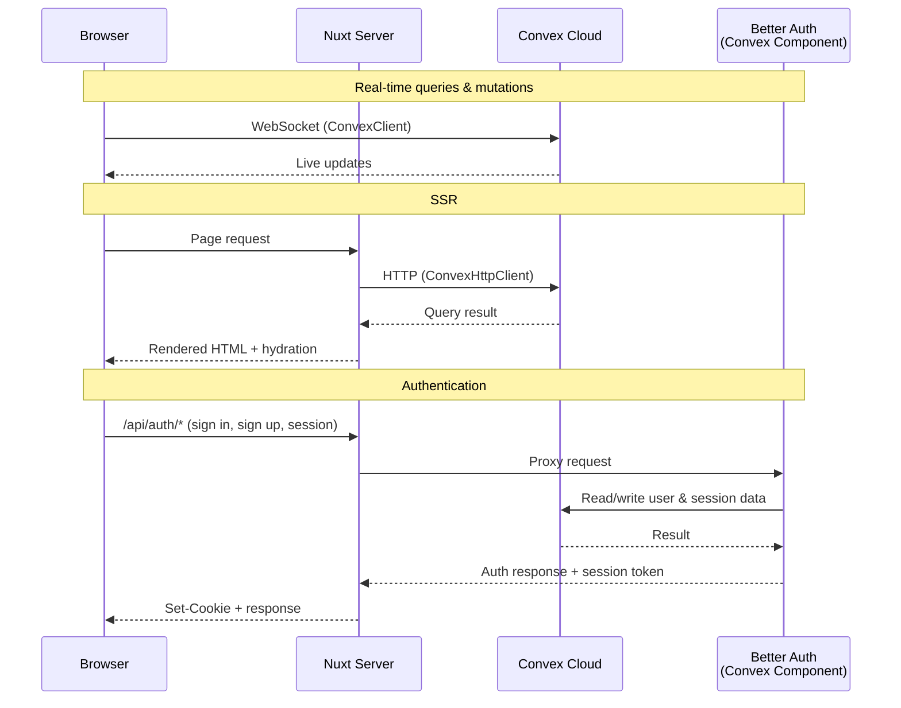

# nuxt-backend reference

This document contains the detailed API, configuration, export, architecture, and development reference for `nuxt-backend`.

For installation and the end-to-end integration walkthrough, see [../README.md](../README.md).

## Features

### Nuxt module

- Real-time Convex client via `useConvex`, `useQuery`, `useMutation`, and `useAction`
- SSR helpers via `fetchQuery`, `fetchMutation`, `fetchAction`, `preloadQuery`, and `backendAuth(event)`
- Auto-imported composables and server utilities
- Built-in `auth` route middleware
- Auto-scaffolded Convex root files
- Optional local hybrid Better Auth component scaffolding

### Convex component

- Better Auth email/password support out of the box
- Convex adapter for Better Auth persistence
- HTTP auth endpoints served through Convex

## Official Integration Parity

`nuxt-backend` ports the official Better Auth Convex React/Next integration to Vue/Nuxt. The package preconfigures the same moving parts, but gives them Nuxt defaults:

| Official React/Next piece | Nuxt/Vue equivalent |
|---|---|
| Manual Better Auth Convex component files | Packaged `nuxt-backend/convex/component/convex.config` by default, or local `backend/components/backend/*` with `backend.installation: 'local'` |
| `auth.config.ts` using the Better Auth Convex provider | `nuxt-backend/convex/auth.config`, scaffolded as `backend/auth.config.ts` |
| `auth.ts` with `authComponent`, `createAuthOptions`, `options`, `createAuth` | Scaffolded `backend/auth.ts` using `setupAuth(...)` |
| Better Auth client with `convexClient()` | Auto-created Vue Better Auth client exposed through `useAuth()` |
| `ConvexBetterAuthProvider` | Nuxt client plugin plus `useConvexAuth()`/`provideConvexAuth()` state |
| Next route handler proxy | Nuxt server proxy at `backend.authRoute`, default `/api/auth` |
| `convexBetterAuthNextJs()` | `backendAuth(event)` for H3/Nitro handlers |
| `usePreloadedAuthQuery()` | `usePreloadedAuthQuery()` for Vue hydration |

The goal is API parity where it matters, with less setup: Nuxt owns route registration, app scaffolding, composable auto-imports, and the same-origin auth proxy.

## Nuxt module provided APIs

For the grouped overview of everything the module registers when installed — configuration, app-runtime composables/components/plugins, server utilities, import aliases, scaffolded files, types, and the Convex bridge entrypoints — see [What this module provides](../README.md#what-this-module-provides) in the README. It also includes a full triage of the complete Nuxt module surface against what `nuxt-backend` provides versus what stays app-owned.

The sections below document each of those APIs in detail.

In addition to the auto-imported APIs, the scaffolded `backend/auth.ts` re-exports `authComponent`, `createAuthOptions`, `options`, `createAuth`, and `getAuthUser` for app Convex functions to import.

## Client APIs

The Nuxt module auto-imports two API groups in app code:

- Convex Vue APIs from the package runtime: `useConvex`, `useQuery`, `useQueries`, `useMutation`, `useAction`, `usePaginatedQuery`, `usePreloadedQuery`, `usePreloadedAuthQuery`, `useConvexConnectionState`
- File storage helpers: `useUpload`, `useUploadQueue`, `useStorageUrl`
- Better Auth helper: `useAuth`

### `useConvex()` and `$convex`

```vue
<script setup lang="ts">
const convex = useConvex()
// or: const { $convex } = useNuxtApp()
</script>
```

Returns the client-side `ConvexVueClient` injected by the Nuxt plugin. There is no server-side `$convex` injection; in Nitro routes and other server code, use `fetchQuery`, `fetchMutation`, `fetchAction`, or `preloadQuery` instead.

### `useQuery()` / `useConvexQuery()`

Returns a `ShallowRef<T | undefined>` and throws query errors. Use
`useQuery_experimental()` if you want errors returned in the result instead.

```vue
<script setup lang="ts">
import { computed } from 'vue'
import { api } from '#backend/api'

const messages = useQuery(api.messages.list, {})
// messages.value: Message[] | undefined

const profile = useQuery(
  api.users.get,
  computed(() => userId.value ? { userId: userId.value } : 'skip'),
)
</script>
```

### `useQuery_experimental()`

The experimental object form returns a `ShallowRef` of a discriminated union with `status` and either `data` or `error`. Errors are returned in the result unless `throwOnError: true` is set, in which case they are thrown.

```vue
<script setup lang="ts">
import { computed } from 'vue'
import { api } from '#backend/api'

const result = useQuery_experimental({
  query: api.messages.list,
  args: computed(() => ({ channel: channel.value })),
  throwOnError: false,
})

// result.value.status: 'pending' | 'success' | 'error'
</script>
```

### `useQueries()` / `useConvexQueries()`

Use this when the set of active queries is dynamic.

```vue
<script setup lang="ts">
import { api } from '#backend/api'

const results = useQueries({
  messages: { query: api.messages.list, args: { channel: '#general' } },
  me: { query: api.users.me, args: {} },
})

// results.value.messages
// results.value.me
</script>
```

### `useMutation()` / `useConvexMutation()`

```vue
<script setup lang="ts">
import { api } from '#backend/api'

const sendMessage = useMutation(api.messages.send)
await sendMessage({ body: 'Hello!' })

const optimisticSend = sendMessage.withOptimisticUpdate((localStore, args) => {
  localStore.setQuery(api.messages.list, {}, [
    { _id: 'optimistic', body: args.body },
  ])
})
</script>
```

### `useAction()` / `useConvexAction()`

```vue
<script setup lang="ts">
import { api } from '#backend/api'

const generateImage = useAction(api.images.generate)
const url = await generateImage({ prompt: 'a cat' })
</script>
```

### `usePaginatedQuery()`

```vue
<script setup lang="ts">
import { api } from '#backend/api'

const messages = usePaginatedQuery(
  api.messages.list,
  { channel: '#general' },
  { initialNumItems: 20 },
)

messages.value.loadMore(20)
</script>
```

Returns a `ShallowRef` of `{ results, status, isLoading, loadMore }`, where `status` is one of `'LoadingFirstPage' | 'CanLoadMore' | 'LoadingMore' | 'Exhausted'`. Query errors are thrown. Use `usePaginatedQuery_experimental()` if you want errors returned in the result instead.

### `usePaginatedQuery_experimental()`

Adds an object-form overload on top of `usePaginatedQuery`. The positional overload behaves exactly like `usePaginatedQuery` (TitleCase `status`, throws on error). The object overload returns `{ data, status, error, canLoadMore, isLoading, loadMore }`, where `status` is one of `'pending' | 'success' | 'error'`; errors are returned via `status: 'error'` unless `throwOnError: true` is set.

```vue
<script setup lang="ts">
import { api } from '#backend/api'

const messages = usePaginatedQuery_experimental({
  query: api.messages.list,
  args: { channel: '#general' },
  initialNumItems: 20,
})
// messages.value.status: 'pending' | 'success' | 'error'
</script>
```

> React backs its experimental hook with the Convex client's native `PaginatedQueryClient`, which the published `convex` package does not export. This port reuses the same manual page-management implementation `usePaginatedQuery` uses, which yields identical observable results.

### `usePreloadedQuery()`

Consumes the `Preloaded<Query>` payload returned by `preloadQuery` on the server and switches to live client updates once the browser-side client has data.

### `usePreloadedAuthQuery()`

Consumes the `Preloaded<Query>` payload returned by `backendAuth(event).preloadAuthQuery(...)`.

```vue
<script setup lang="ts">
const { data: preloaded } = await useFetch('/api/account.preload')
const currentUser = usePreloadedAuthQuery(preloaded.value!)
</script>
```

This mirrors the official Next client helper. It keeps the server result visible while Convex auth is loading in the browser, skips the live query if the user is unauthenticated, and switches to the live authenticated query after client auth is ready.

### `useConvexConnectionState()`

```vue
<script setup lang="ts">
const connection = useConvexConnectionState()
</script>

<template>
  <span v-if="!connection.isWebSocketConnected">Offline</span>
</template>
```

### File storage

Convenience helpers for [Convex file storage](https://docs.convex.dev/file-storage). Convex's own React client ships no upload composable — file storage is plain app code (a `generateUploadUrl` mutation, a `POST` to the returned URL, then a query/HTTP action to serve the file). These helpers wrap that flow with reactive progress, cancellation, queueing, and URL resolution, while staying type-safe against your own functions. They sit outside the React parity surface but are auto-imported like every other composable.

They assume your Convex backend exposes the standard storage functions, for example `backend/files.ts`:

```ts
import { v } from 'convex/values'
import { mutation, query } from './_generated/server'

// Returns a one-time upload URL. Add auth checks as needed.
export const generateUploadUrl = mutation({
  args: {},
  handler: ctx => ctx.storage.generateUploadUrl(),
})

// Resolve the served URL for a stored file (null if it was deleted).
export const getUrl = query({
  args: { storageId: v.id('_storage') },
  handler: (ctx, { storageId }) => ctx.storage.getUrl(storageId),
})
```

#### `useUpload()` / `useConvexUpload()`

Upload a single file with reactive `isUploading`, `progress` (`0`–`1`), `error`, and `storageId`. `upload()` resolves to the new storage id (or `null` on failure — inspect `error` rather than `try`/`catch`). Pass the resulting id to your own mutation to persist it. Uploads are client-only; calling `upload()` during SSR resolves to `null`.

```vue
<script setup lang="ts">
const saveImage = useMutation(api.images.save)
const { upload, isUploading, progress, error, cancel } = useUpload(
  api.files.generateUploadUrl,
  { onSuccess: storageId => saveImage({ storageId }) },
)

async function onPick(event: Event) {
  const file = (event.target as HTMLInputElement).files?.[0]
  if (file) await upload(file)
}
</script>

<template>
  <input type="file" :disabled="isUploading" @change="onPick">
  <progress v-if="isUploading" :value="progress" />
  <button v-if="isUploading" @click="cancel">Cancel</button>
  <p v-if="error">{{ error.message }}</p>
</template>
```

`onProgress`, `onSuccess(storageId, file)`, and `onError(error, file)` callbacks are supported. `cancel()` aborts the in-flight upload; `reset()` clears `progress`/`error`/`storageId`.

#### `useUploadQueue()` / `useConvexUploadQueue()`

Upload many files with bounded concurrency (default `3`). `enqueue()` accepts a file, an array, or a `FileList` straight from a multi-file `<input>` and starts uploading immediately. Exposes a reactive `items` list (each with its own `status`/`progress`/`storageId`/`error`), aggregate `progress`, `isUploading`, `activeCount`, and `pendingCount`.

```vue
<script setup lang="ts">
const saveImage = useMutation(api.images.save)
const { items, enqueue, progress, isUploading } = useUploadQueue(
  api.files.generateUploadUrl,
  { concurrency: 4, onItemSuccess: storageId => saveImage({ storageId }) },
)
</script>

<template>
  <input type="file" multiple @change="enqueue(($event.target as HTMLInputElement).files)">
  <progress v-if="isUploading" :value="progress" />
  <ul>
    <li v-for="item in items" :key="item.id">
      {{ item.status }} — {{ Math.round(item.progress * 100) }}%
    </li>
  </ul>
</template>
```

`cancel()` aborts all in-flight uploads, `remove(id)` drops one item, and `clear()` empties the queue. `onItemSuccess`, `onItemError`, and `onComplete` callbacks are supported.

#### `useStorageUrl()` / `useConvexStorageUrl()`

Reactively resolve a stored file's served URL via your `getUrl` query. Accepts a reactive storage id and automatically skips the query while the id is `null`/`undefined`, so it binds straight to an id ref.

```vue
<script setup lang="ts">
const { storageId } = useUpload(api.files.generateUploadUrl)
const url = useStorageUrl(api.files.getUrl, storageId)
</script>

<template>
  
</template>
```

Returns a shallow ref of `string | null` once loaded (`null` if the file is gone) or `undefined` while loading/skipped.

#### `uploadFile()`

Low-level promise-based uploader behind the composables, for use outside a component setup (e.g. utilities or tests). Takes `{ url, file, onProgress?, signal? }` and resolves to the storage id:

```ts
import { uploadFile } from '#imports'

const url = await convex.mutation(api.files.generateUploadUrl, {})
const storageId = await uploadFile({ url, file })
```

### Component composables

Reactive helpers for the bundled components — all thin, typed wrappers over `useQuery` that drive the queries exposed by the scaffolded component files.

```vue
<script setup lang="ts">
import { api } from '#backend/api'

// Debounced, reactive full-text search. Pauses while the term is blank.
const term = ref('')
const { results, isLoading } = useSearch(api.search.searchMessages, term, { debounce: 200 })

// Live aggregate count (coerces loading/null to 0). `useCount` is an alias.
const messageCount = useCount(api.aggregates.countMessages)

// Billing: subscription state + checkout/portal; feature-gating; prepaid credits.
const billing = useBilling() // billing.subscription, billing.isSubscribed, billing.checkout(...)
const { has, hasPlan } = useFeatures() // has('priority_support'), hasPlan('prod_pro')
const credits = useCredits() // credits.balance, credits.topUp(packId), credits.refresh()

// Live durable-workflow status; pauses while the id is null/undefined.
const status = useWorkflowStatus(api.workflows.status, workflowId)
</script>
```

### Better Auth composables

`useAuth()` is the single Better Auth service. It exposes the Better Auth client, the reactive session wrapper, and the computed auth state used by the Convex integration:

```vue
<script setup lang="ts">
const { client, session, isAuthenticated, isLoading } = useAuth()

await client.signIn.email({ email: 'user@example.com', password: 'secret' })
const user = computed(() => session.value.data?.user)
</script>
```

### Advanced low-level auth helpers

The package also exports low-level Convex auth helpers for custom auth integrations: `provideConvexAuth`, `useConvexAuth`, `Authenticated`, `Unauthenticated`, and `AuthLoading`.

These are advanced building blocks for custom auth providers. They are not required for the default Better Auth setup scaffolded by the module.

## Route protection

Guard pages with the built-in `auth` middleware:

```vue
<script setup>
definePageMeta({ middleware: 'auth' })
</script>
```

Unauthenticated users are redirected to `/login`.

## Server utilities

Auto-imported in the `server/` directory and Nitro handlers. These mirror the official `convex/nextjs` API surface. There is no server-side injected Convex client; all server access goes through these helpers.

```ts
// server/api/example.ts
export default defineEventHandler(async () => {
  const messages = await fetchQuery(api.messages.list, {})
  await fetchMutation(api.messages.send, { body: 'From server' })
  const result = await fetchAction(api.images.generate, { prompt: 'cat' })
  return messages
})
```

### Authenticated calls

Use `backendAuth(event)` for authenticated server-side calls. It mirrors the official Next integration helper, but accepts the current H3 event:

```ts
// server/api/profile.ts
export default defineEventHandler(async (event) => {
  const auth = backendAuth(event)
  if (!await auth.isAuthenticated()) throw createError({ statusCode: 401 })

  return await auth.fetchAuthQuery(api.users.me, {})
})
```

Use `auth.getToken()` if you need to pass the token to a lower-level `fetchQuery`, `fetchMutation`, or `fetchAction` call yourself.

### Preloading

```ts
const preloaded = await preloadQuery(api.messages.list, {})
const data = preloadedQueryResult(preloaded)
```

The payload returned by `preloadQuery` is designed to be passed back to app code and consumed with `usePreloadedQuery`.

```ts
// server/api/messages.preload.ts
export default defineEventHandler(async () => {
  return preloadQuery(api.messages.list, {})
})
```

```vue
<script setup lang="ts">
const { data: preloaded } = await useFetch('/api/messages.preload')
const messages = usePreloadedQuery(preloaded.value!)
</script>
```

For auth-protected data, preload through `backendAuth(event)` and hydrate with `usePreloadedAuthQuery`:

```ts
// server/api/account.preload.ts
export default defineEventHandler((event) => {
  return backendAuth(event).preloadAuthQuery(api.auth.getAuthUser, {})
})
```

```vue
<script setup lang="ts">
const { data: preloaded } = await useFetch('/api/account.preload')
const currentUser = usePreloadedAuthQuery(preloaded.value!)
</script>
```

| Function | Description |
|---|---|
| `fetchQuery` | Run a query and optionally pass `{ token }` for auth |
| `fetchMutation` | Run a mutation and optionally pass `{ token }` for auth |
| `fetchAction` | Run an action and optionally pass `{ token }` for auth |
| `preloadQuery` | Preload query data for SSR |
| `preloadedQueryResult` | Extract the result from a preloaded query payload |
| `backendAuth` | Create authenticated server helpers for the current H3 event |

`backendAuth(event)` returns these helpers:

| Helper | Description |
|---|---|
| `handler` | Proxy Better Auth requests from Nuxt to the Convex site URL |
| `getToken` | Fetch a Convex auth token from the Better Auth session |
| `isAuthenticated` | Check whether the current request has an authenticated Convex token |
| `fetchAuthQuery` | Run an authenticated Convex query |
| `fetchAuthMutation` | Run an authenticated Convex mutation |
| `fetchAuthAction` | Run an authenticated Convex action |
| `preloadAuthQuery` | Preload an authenticated query for `usePreloadedAuthQuery` |

## Configuration

All options have sensible defaults. Environment variables are picked up automatically.

```ts
// nuxt.config.ts
export default defineNuxtConfig({
  modules: ['nuxt-backend'],
})
```

The `backend` options are optional. The module first reads `url` and `siteUrl` from explicit module options, then falls back to the canonical Nuxt app environment variables.

```ts
// nuxt.config.ts
export default defineNuxtConfig({
  modules: ['nuxt-backend'],
  backend: {
    url: 'https://your-deployment.convex.cloud',
    siteUrl: 'https://your-deployment.convex.site',
    authRoute: '/api/auth',
  },
})
```

Auth is always enabled by the module. The only installation choice is whether the first scaffold uses the packaged component defaults or creates a local hybrid component for schema ownership.

### Environment variables

Minimal app environment file:

```bash
# .env.local
NUXT_PUBLIC_CONVEX_URL=https://your-deployment.convex.cloud
NUXT_PUBLIC_CONVEX_SITE_URL=https://your-deployment.convex.site
```

Required Convex dashboard environment variables:

```bash
SITE_URL=https://nuxt-backend.localhost
BETTER_AUTH_SECRET=<random-secret>
```

| Variable | Where | Description |
|---|---|---|
| `NUXT_PUBLIC_CONVEX_URL` | `.env.local` or `.env` | Convex deployment URL used by the Nuxt app |
| `NUXT_PUBLIC_CONVEX_SITE_URL` | `.env.local` or `.env` | Convex site URL used by the Nuxt auth proxy |
| `SITE_URL` | Convex dashboard | App URL such as `https://nuxt-backend.localhost` |
| `BETTER_AUTH_SECRET` | Convex dashboard | Secret used by Better Auth |

The bundled components add the following **optional** Convex dashboard variables, declared with typed validators in the scaffolded `convex.config.ts` (`defineApp({ env })`). Leave any unset to keep that feature a graceful no-op:

| Variable | Feature |
|---|---|
| `RESEND_API_KEY`, `RESEND_FROM`, `RESEND_TEST_MODE` | Email (Resend) — forwarded to the nested `backend` component via `app.use(backend, { env })` |
| `POLAR_ORGANIZATION_TOKEN`, `POLAR_WEBHOOK_SECRET`, `POLAR_SERVER` | Billing (Polar) |

## Customizing the Convex component

Zero-config mode mounts the packaged component and registers Better Auth HTTP routes from `backend/http.ts`. The default route is `/api/auth`.

If you want to keep the packaged component but extend Better Auth options such as providers or plugins, customize `setupAuth(...)` in `backend/auth.ts`:

```ts
import { setupAuth } from 'nuxt-backend/convex'
import { components } from './_generated/api'
import { query } from './_generated/server'

export const {
  authComponent,
  createAuthOptions,
  options,
  createAuth,
  getAuthUser,
} = setupAuth(components.backend, query, {
  authOptions: {
    appName: 'Acme',
    emailAndPassword: {
      enabled: true,
    },
  },
})
```

If you want a different auth route, update the scaffolded files:

```ts
// backend/convex.config.ts (email config forwarded to the nested Resend; see
// "Backend components" for the full declaration)
import { defineApp } from 'convex/server'
import { v } from 'convex/values'
import backend from 'nuxt-backend/convex/component/convex.config'

const app = defineApp({ env: { RESEND_API_KEY: v.optional(v.string()) } })
app.use(backend, { env: { RESEND_API_KEY: app.env.RESEND_API_KEY } })
export default app
```

```ts
// backend/auth.ts
export const {
  authComponent,
  createAuthOptions,
  options,
  createAuth,
  getAuthUser,
} = setupAuth(components.backend, query, {
  basePath: '/internal/auth',
})
```

```ts
// backend/auth.config.ts
import { defineBackendAuthConfig } from 'nuxt-backend/convex/auth.config'

export default defineBackendAuthConfig({
  basePath: '/internal/auth',
})
```

If you change the Nuxt module's `backend.authRoute`, keep these Convex component helpers on the same path.

The packaged component is intentionally opinionated for zero setup. If you need full Better Auth ownership beyond route wiring, switch the first scaffold to local hybrid installation:

```ts
// nuxt.config.ts
export default defineNuxtConfig({
  modules: ['nuxt-backend'],
  backend: {
    installation: 'local',
  },
})
```

Local mode creates `backend/components/backend/convex.config.ts`, `schema.ts`, `generated-schema.ts`, `adapter.ts`, and a schema-generation `auth.ts`. Regenerate `generated-schema.ts` after schema-affecting Better Auth changes:

```bash
npx auth generate --config ./backend/components/backend/auth.ts --output ./backend/components/backend/generated-schema.ts
```

Keep hand-written indexes and schema customizations in `backend/components/backend/schema.ts`; it imports and spreads the generated tables so regeneration does not overwrite local edits.

## Recommended package contract

The stable user-facing surface should stay narrow and opinionated. The package should provide these layers:

| Layer | API | Capability |
|---|---|---|
| Bootstrap | Nuxt module options: `backend.url`, `backend.siteUrl`, `backend.authRoute`, `backend.installation` | One place to configure Convex, auth route wiring, and first-run scaffold ownership |
| Scaffolding | Generated `backend/convex.config.ts`, `backend/auth.config.ts`, `backend/auth.ts`, `backend/http.ts` | Zero-config first run with an escape hatch to own the files later |
| Runtime data | `useConvex`, `useQuery`, `useQueries`, `useMutation`, `useAction`, `usePaginatedQuery`, `usePreloadedQuery`, `usePreloadedAuthQuery`, `useConvexConnectionState` | Real-time Convex data and hydration-safe SSR |
| File storage | `useUpload`, `useUploadQueue`, `useStorageUrl`, `uploadFile` | Reactive uploads with progress/cancel/queueing and served-URL resolution over Convex file storage |
| Runtime auth | `useAuth`, `auth` middleware | Better Auth client access, session state, sign-in/out, and route protection in Nuxt |
| Server data | `fetchQuery`, `fetchMutation`, `fetchAction`, `preloadQuery`, `preloadedQueryResult`, `backendAuth` | Nitro and SSR access to Convex, including authenticated helper calls |
| Convex auth bridge | `nuxt-backend/convex/component/convex.config`, `nuxt-backend/convex/component/schema`, `nuxt-backend/convex/auth.config`, `nuxt-backend/convex` | Mount the packaged component, seed local schemas, align Convex auth config, and create Better Auth helpers |
| Testing | `nuxt-backend/convex/test` | Register the packaged component in `convex-test` |

The package-specific capabilities, beyond the raw Better Auth component, are:

- Same-origin auth proxying from Nuxt to Convex so cookies stay on the app domain.
- Route alignment between the Nuxt auth proxy, Better Auth `basePath`, and Convex JWKS/auth provider config.
- Reactive Better Auth access through `useAuth().session` and server-side token forwarding through `fetchQuery(..., { token })`.
- A small Convex auth bridge with `setupAuth(...)`, `createAuthOptions(ctx)`, `options`, `createAuth(ctx)`, and `getAuthUser` so apps can stay close to Convex conventions.
- A zero-config path for new apps, plus local hybrid scaffolding for apps that need schema ownership.

The package should not try to own app-specific user schema, onboarding, profile storage, or product authorization rules. It should provide the auth transport and integration contract, then let the app define domain behavior on top.

## Package exports

The package publishes multiple entrypoints:

| Export | Use for |
|---|---|
| `nuxt-backend` | The Nuxt module used in `modules: ['nuxt-backend']` |
| `nuxt-backend/convex` | App-side helper bridge for the packaged Convex component (`createAuth(ctx, component, ...)`, `makeAuthApi(...)`, `setupAuth(...)`) |
| `nuxt-backend/convex/component/convex.config` | Mounting the packaged Convex component in `convex.config.ts` |
| `nuxt-backend/convex/component/schema` | Base Better Auth tables for local hybrid schema scaffolding |
| `nuxt-backend/convex/auth.config` | Creating `auth.config.ts` with `defineBackendAuthConfig(...)` |
| `nuxt-backend/convex/test` | Registering the packaged Convex component in `convex-test` |
| `nuxt-backend/convex/billing` | `setupBilling(...)` — subscriptions, discounts & prepaid credits via the Polar component |
| `nuxt-backend/convex/rate-limit` | `setupRateLimiter(...)` + `DEFAULT_AUTH_LIMITS` |
| `nuxt-backend/convex/migrations` | `setupMigrations(...)` — online schema migrations |
| `nuxt-backend/convex/aggregate` | `TableAggregate`, `withTriggers`, `Triggers` — denormalized counts/sums |
| `nuxt-backend/convex/workflows` | `setupWorkflows(...)` — durable multi-step functions |
| `nuxt-backend/convex/search` | `search(...)` (fluent) + `defineSearch(...)` over native full-text search |

### `nuxt-backend/convex`

This entrypoint exposes the same two client-code patterns described in the Convex component authoring docs:

- A simple wrapper via `createAuth(ctx, component, options?)`
- A ready-made API remount helper via `makeAuthApi(component, query)`

`setupAuth(...)` is a convenience helper that composes both patterns for the common scaffolded case.

This is what the scaffolded `backend/auth.ts` uses:

```ts
import { setupAuth } from 'nuxt-backend/convex'
import { components } from './_generated/api'
import { query } from './_generated/server'

export const {
  authComponent,
  createAuthOptions,
  options,
  createAuth,
  getAuthUser,
} = setupAuth(components.backend, query)
```

### `nuxt-backend/convex/test`

Use this when testing the packaged component with `convex-test`:

```ts
import { convexTest } from 'convex-test'
import backendTest from 'nuxt-backend/convex/test'

const t = convexTest(schema, modules)
backendTest.register(t)
```

## Backend components

The [Resend](https://www.convex.dev/components/resend) component is **nested inside `backend`**, so email works out of the box with no app-level mount. The scaffolded `convex.config.ts` additionally mounts the [Polar](https://www.convex.dev/components/polar), [Workflow](https://www.convex.dev/components/workflow), [Rate Limiter](https://www.convex.dev/components/rate-limiter), [Migrations](https://www.convex.dev/components/migrations), and [Aggregate](https://www.convex.dev/components/aggregate) components, declares the deployment's environment variables with typed validators, and **forwards** the email config to the nested component ([components are isolated from the app's env](https://docs.convex.dev/components)):

```ts
import { defineApp } from 'convex/server'
import { v } from 'convex/values'
import backend from 'nuxt-backend/convex/component/convex.config'
// …and the other five components

const app = defineApp({
  env: {
    RESEND_API_KEY: v.optional(v.string()),
    POLAR_SERVER: v.optional(v.union(v.literal('sandbox'), v.literal('production'))),
    // …see the env-var table below
  },
})
// Resend is nested in `backend`; forward its config by reference.
app.use(backend, {
  env: {
    RESEND_API_KEY: app.env.RESEND_API_KEY,
    RESEND_FROM: app.env.RESEND_FROM,
    RESEND_TEST_MODE: app.env.RESEND_TEST_MODE,
  },
})
// …app.use() the rest
export default app
```

Each app-level setup helper accepts the typed `env` from `_generated/server` and degrades gracefully when its variables are unset.

### Email — `components.backend.email.send` (nested)

Email is served by the `backend` component itself via the nested Resend component, so there is no setup helper or app-level mount — just set `RESEND_API_KEY`. Call it from any app function (action, mutation, or a Workflow step):

```ts
await ctx.runMutation(components.backend.email.send, {
  to: 'user@example.com',
  subject: 'Welcome!',
  html: '<p>Hello</p>',
})
```

It enqueues a durable email and resolves to the email id, or logs and resolves to `null` when `RESEND_API_KEY` is unset. The same path powers auth OTP / verification / reset automatically (see [cross-component wiring](#cross-component-auth-wiring--setupauth--integrations-)). With `RESEND_TEST_MODE` left on (the default), only Resend's test addresses receive mail — set it to `"false"` to deliver to real recipients.

### Billing — `setupBilling(components.polar, components.backend, config)`

Subscriptions, discounts, and **prepaid credits** via the Polar component, linked to your auth users. The config mirrors the Polar client (`getUserInfo`, `products?`, `organizationToken?`, `server?`) plus a query-safe `currentUserId(ctx)` resolver used by the reactive reads. The reactive **feature + credit cache** lives inside the bundled `backend` component, so **you add nothing to your schema**.

Returns:

- `api` — `polar.api()`: checkout / portal / product / subscription functions to re-export.
- `functions` — ready-made reactive functions to re-export so the composables work with zero wiring: `getCurrentSubscription` (→ `useBilling`), `getFeatures` (→ `useFeatures`), `getCredits` (→ `useCredits`), and a `syncEntitlements` action to refresh the cache after checkout/top-up.
- `webhookEvents` — typed Polar webhook handlers for `polar.registerRoutes(http, { events })` that keep the cache fresh (subscriptions, benefit grants, credit balances).
- `spendCredits(ctx, { userId, name, meterId?, value? })` — spend prepaid credits from your **own server** code; with `meterId` set it throws when the balance is too low, so credits are never billed as overage.
- `getCustomerState` / `createDiscount` / `polar` — live customer state, coupon creation, and the raw client.

**Credits are Polar's official model:** a credit pack is a one-time product whose *Credits* benefit tops up a meter balance (no backend crediting code needed). The client tops up via `useCredits().topUp(packId)` (a checkout) and the balance is drawn down by `spendCredits`. The auto-imported composables — `useBilling` (subscriptions/checkout/portal), `useFeatures` (`has()` / `hasPlan()`), `useCredits` (`balance` / `topUp` / `refresh`) — read the cache reactively.

**Feature-gating by a friendly name:** `useFeatures().has(feature)` matches a granted benefit by its Polar benefit id, grant id, `type`, **or any value in the benefit's metadata**. So set a stable key on the Polar benefit (e.g. metadata `{ key: 'premium' }`) and gate with `has('premium')` instead of hardcoding a UUID. The cache reads the benefit's metadata **live** (not the grant-time snapshot), so changing it takes effect on the next sync — no re-granting.

### Rate limiting — `setupRateLimiter(components.rateLimiter, limits?)`

Returns a `RateLimiter` pre-seeded with `DEFAULT_AUTH_LIMITS` (`emailOtp`, `signIn`, `signUp`, `passwordReset`); your `limits` are merged on top.

### Migrations — `setupMigrations(components.migrations, { schema? })`

Returns `{ migrations, run }`. Define migrations with `migrations.define({ table, migrateOne })` and run them via `npx convex run migrations:run '{ "fn": "migrations:yourMigration" }'`.

### Workflows — `setupWorkflows(components.workflow, options?)`

Returns a `WorkflowManager` with sensible default retry behaviour. Define durable functions with `workflow.define({ args, handler })` and start them with `workflow.start(ctx, internal.x.y, args)`.

### Aggregates — `TableAggregate`, `withTriggers`, `Triggers`

Construct one `TableAggregate` per mounted instance and keep it in sync automatically:

```ts
import { TableAggregate, Triggers, withTriggers } from 'nuxt-backend/convex/aggregate'

export const messagesCount = new TableAggregate<{ Key: null, DataModel: DataModel, TableName: 'messages' }>(
  components.aggregate,
  { sortKey: () => null },
)
const triggers = new Triggers<DataModel>()
triggers.register('messages', messagesCount.trigger())
export const mutation = withTriggers(rawMutation, triggers)
```

### Fluent search — `search(...)` and `defineSearch(...)`

A type-safe builder over Convex's native `searchIndex` — index names, search fields, and `eq` filters are checked against your schema:

```ts
const results = await search(ctx, 'messages')
  .withSearchIndex('search_text')
  .search('text', term)
  .eq('userId', userId)
  .take(20)
```

`defineSearch(query, { table, index, searchField, defaultLimit? })` turns that into a ready query taking `{ query, limit? }`, which the `useSearch` composable drives reactively.

### Cross-component auth wiring — `setupAuth(..., { integrations })`

OTP / verification / reset emails are routed through the nested Resend component **automatically** — you don't pass an `email` integration. `integrations` accepts `{ rateLimiter, onUserCreated, email? }`: the `rateLimiter` throttles OTP sends, `onUserCreated(ctx, user)` runs on signup, and `email?` is an optional override if you want to bypass the nested transport. The ctx passed to `onUserCreated` is a full mutation/action ctx, so it can start a Workflow:

```ts
export const { authComponent, createAuth, getAuthUser } = setupAuth(components.backend, query, {
  integrations: {
    // email is automatic via the nested Resend component (set RESEND_API_KEY)
    rateLimiter,
    onUserCreated: async (ctx, user) => {
      await workflow.start(ctx, internal.workflows.onSignup, {
        userId: user.id, email: user.email, name: user.name,
      })
    },
  },
})
```

With no `RESEND_API_KEY` configured, OTP codes log to the console instead of sending (graceful no-op).

## Architecture

The package ships two things in one:

| Layer | What it does |
|---|---|
| **Nuxt module** (`nuxt-backend`) | Registers plugins, composables, server utilities, auth proxy, and auto-scaffolds Convex root files |
| **Convex component** (`nuxt-backend/convex/component/convex.config`) | Defines the `backend` component with a Better Auth adapter proxy and auth config |



- Client: `ConvexVueClient` connects via WebSocket for real-time reactivity.
- Server: `fetchQuery`, `fetchMutation`, `fetchAction`, and `preloadQuery` use `ConvexHttpClient` under the hood. Pass `{ token }` when auth is required.
- Auth proxy: `/api/auth/*` is proxied to the Convex site URL so cookies stay same-origin.

## Development

This package ships both a Nuxt module and a Convex component. The development workflow runs both environments in parallel.

```bash
pnpm install
pnpm run dev
```

### Dev scripts

`pnpm run dev` prepares the Nuxt module and then starts three processes in parallel:

| Script | Description |
|---|---|
| `dev:prepare` | Generates type stubs and prepares the playground |
| `dev:convex-component` | Convex dev server with component typechecking |
| `dev:convex-component:codegen` | Watches `src/convex/` and re-runs codegen for `src/convex/component/` |
| `dev:nuxt-module` | Nuxt dev server with the playground app |
| `dev:nuxt-module:prepare` | Alias for `dev:prepare` |
| `dev:nuxt-module:build` | Full Nuxt build of the playground |

### Build scripts

| Script | Description |
|---|---|
| `build` | Build both the Convex component and Nuxt module |
| `build:convex-component` | Codegen and TypeScript declarations for the component |
| `build:nuxt-module` | Build the Nuxt module with `nuxt-module-build` |
| `prepack` | Full build before publish |

### Test scripts

| Script | Description |
|---|---|
| `test` | Run all test suites via Vitest |
| `test:unit` | Unit tests only |
| `test:convex` | Convex component tests |
| `test:nuxt` | Nuxt environment tests |
| `test:e2e` | End-to-end tests |
| `test:types` | Typecheck the module, component, and playground |
| `test:watch` | Watch mode |

### Other scripts

| Script | Description |
|---|---|
| `lint` | ESLint |
| `lint:fix` | ESLint with `--fix` |
| `bump` | Run `taze` to bump dependency major versions |
| `release` | Run release-it (conventional commits → version bump + CHANGELOG.md + git tag + optional GitHub Release). The tag triggers `.github/workflows/release.yml` which creates a rich GitHub Release (via changelogithub + gh CLI fallback, with contributor thanks) and publishes to npm with provenance. |
